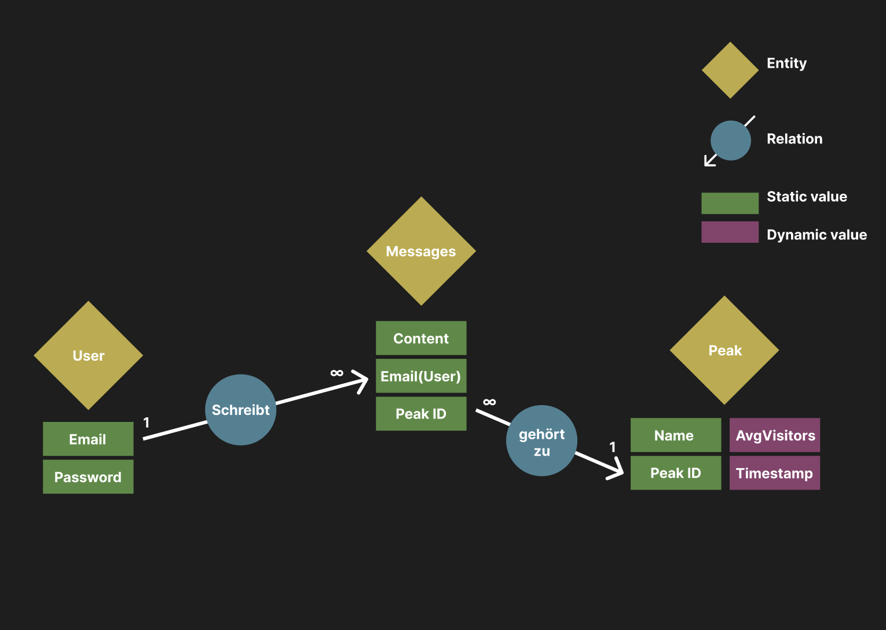

-Projekt Beschreibung-
-API Dokumentation-
-Installation-
-Entity Relationship Model-

-> Peakfinder:
peakfinder ist eine app die es usern ermöglicht auf digitale gipfelbücher zuzugreifen und eigene einträge hinzuzufügen.
dafür hat jeder gipfel ein modul mit einem esp als kern, dieser hostet eine webseite die den gipfelbucheintrag zulässt und usern eine Nachweiß Plattform zu bieten um ihren gipfelstieg in der app als erfolg hinzuzufügen.

Ebenfalls sammelt der esp währenddessen durchschnitts daten der anwesenheit von umliegendengeräten, was zur nachvollziehung der beliebtheit des gipfels folgt.

Diese werte und die Erfolge der usern können diese in der flutter app nachsehen.

-> API Doku

  -> userService 

     -> login
        -> request: Post: {"email":"example@mail.de","password":"123456789"}
        -> response: 200 ->"neuer account wird in datenbank angelegt"

     -> register
        -> request: Post: {"email":"example@mail.de","password":"123456789"}
        -> response: 200 ->"account und password werden im backend verglichen"

     -> registeerMail
        -> request: Post: {"email":"example@mail.de"}
        -> response: 200 -> "email wird an user gesendet, ist für user gedacht welche auf dem berg einen eintrag machen und später benachrichtigt werden sollen, damit sie sich anschliessend einen account machen können und die app runterladen können"

  -> data Service

     -> addData
        -> request: Post: {"msgs":[{"msg":"Hallo","email":"Beispiel@email.de},{"msg":"Hallo","email":"Beispiel@email.de"}],"avgVisitors":[{"timestamp":"230707,"value":"25"},{"timestamp":"230708","value":"25"}],"id":"001"}
             -> value: "average visitors" - timestamp "format JJJJMMTTHH, dadurch ist das jüngste datum automatisch die größte zahl" - id: "eine Zahl die auf den namen dess berges zurückführbar ist"
        -> response: 200 -> "speichert die daten in die datenbank"

     -> getPeakData
        -> request: Get: {"peakId":"001","email":"beispiel@email.de","password":"123456"}
        -> response: -> {"name": peak[0].name,"id": peak[0].peakId,"avgVisitors": peak[0].averageVisitors}
        {"peak": {"name": "Zugspitze","id": "001","avgVisitors": "value"}, "msgs": "[{"msg":"hallo"},{}"msg":"hallo"},...]"}
     
     -> getPeakName
        -> request: Get: {"peakId":"001","newPeakName":"Mount Bacon"} - New Peakname funktioniert nur falls es noch kein mountain mit dieser id in der datenbank existiert, der wert newPeakName ist eigentlich nur zu testzwecken entstanden.
        -> response: {"peakName":"Zugspitze"} or "new peakListItem created"
    
     -> getUserData
        -> request: Get {"email":"beispiel@email.de","password":"123456789"}
        -> response: {"email":"beispiel@email.de","[{"peakId":"001","peakName":"Zugspitze","msg":"Hallo Welt"},{}"peakId":"002","peakName":"Mount Bacon","msg":"Hallo Welt"},...]"}
    
     -> addSingleMessage
        -> request: Post: {"email":"beispiel@email.de","password":"123456","msg":"Hallo Welt","id":"peakId"}
        -> response: 200 -> message saved
    
     -> getAllPeaks
        -> request: get
        -> response: ["{"peakName":"Zugspitze","peakId":"001"},{"peakName":"Zugspitze","peakId":"001"},..."]
        (the responses onnly count if input correct)

Installation:
Zur Installation muss:
->jeweils in userService, dataService und web_register npm i ausgeführt werden
     ->Eine vernünftige .env angelegt werden, siehe .env.example -> userService sollte port 3003 und dataService port 3004 haben
     -> zu den nötigen werten der .env gehören einlog daten zu einer mongodb datenbank, sowie zu einem email provider service
-> Flutter stuff: https://docs.flutter.dev/ -> anschliessend flutter code auf mobilgerät laufen lassen via "flutter run"
-> esp code: auf esp32 hochladen -> plattformio installieren
-> dafür sorgen das alles im gleichen netzwerk läuft

Entity Relationship Model

